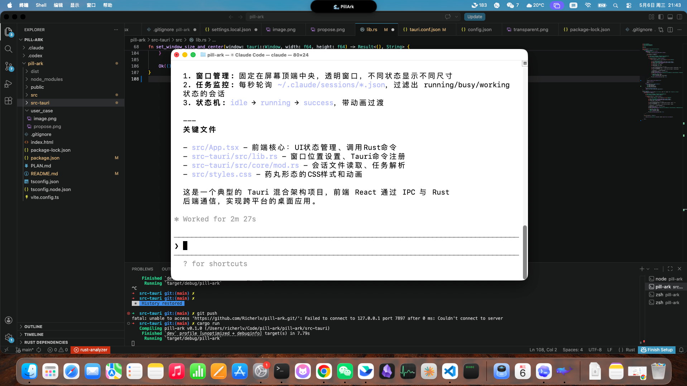
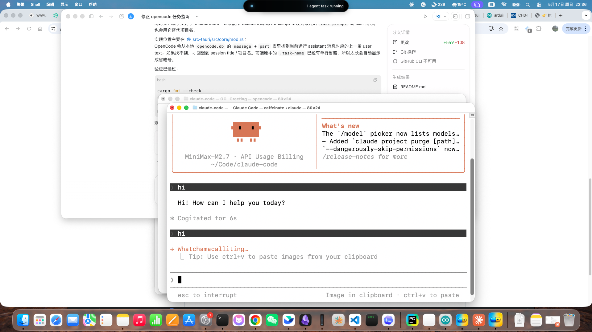
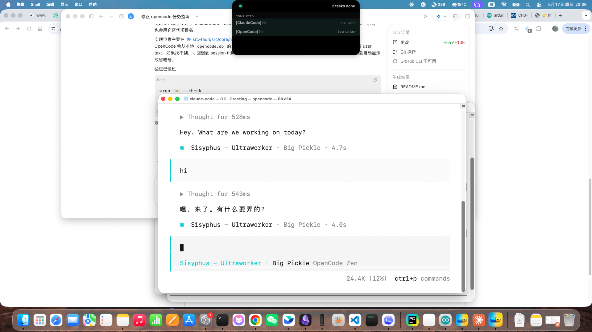

<a id="english"></a>

# PillArk

> Turn Claude Code and opencode background tasks into a quiet, visible desktop pill.

[English](#english) | [中文](#zh-cn)

PillArk is a small macOS desktop utility that floats near the top of your screen and keeps an eye on Claude Code and opencode task status in real time. When nothing is running, it stays as a compact pill. When an agent starts working, it switches into a running state. When a task finishes, it expands briefly so you know what just completed.

If you often start a Claude Code or opencode task and then move back to your editor, browser, or another window, PillArk gives you a lightweight status island without forcing you to keep checking the terminal.

## Download 📥

[Download PillArk for macOS](https://github.com/Richerlv/pill-ark/releases/download/v0.1.3/PillArk_0.1.3_aarch64.dmg)

The link above downloads the latest DMG installer from GitHub Releases. After downloading, open the DMG and drag `PillArk.app` into `Applications`.

## Preview ✨

### Idle 💊

When no active agent task is detected, PillArk stays in its minimal idle state.



### Running ⚡

When Claude Code or opencode starts processing a prompt, the pill updates in real time and shows the number of active tasks.



### Completed ✅

When a task finishes, PillArk expands automatically, shows the completed task, and then returns to the idle state after a few seconds.



## What It Does 🧠

- **Tracks Claude Code in real time**: Reads local Claude session state every second.
- **Supports opencode tasks**: Detects active opencode prompt/LLM activity instead of treating an idle opencode process as a running task.
- **Floats as a desktop pill**: A lightweight Tauri window that stays visible without getting in the way.
- **Shows clear visual states**: Idle, running, and completion states are easy to distinguish at a glance.
- **Expands on completion**: Completed tasks are surfaced automatically, so you do not need to keep checking the terminal.
- **Shows task details**: Click the pill to expand the task list and inspect task names, tools, and process/session details.

## Supported Platforms 🛠️

PillArk currently supports:

- Claude Code (`claude`)
- opencode (`opencode`)
- macOS
- Windows

Claude Code task status is detected by reading `~/.claude/sessions/*.json`. A session is treated as active when its status is `running`, `busy`, `working`, or `thinking`.

opencode task status is detected from opencode's local runtime activity logs and session data. PillArk only treats opencode as active while it is actually processing a prompt, so simply opening opencode without running a task does not trigger the running state.

## Quick Start 🚀

### Requirements

- Node.js 18+
- Rust 1.70+
- macOS

### Install Dependencies

```bash
npm install
```

### Run in Development

```bash
npm run dev
```

This starts the Tauri development server and opens the PillArk desktop window.

### Build the App

```bash
npm run build
```

Tauri will generate the desktop build output for local packaging.

## Usage 🧭

1. Start PillArk.
2. Open Claude Code or opencode and start a task.
3. PillArk switches to the running state within about one second.
4. When the task finishes, PillArk expands with a completion notice.
5. After a few seconds, the pill collapses back to idle.

## Project Structure 🧩

```text
pill-ark/
├── src/                    # React frontend
│   ├── App.tsx             # Main UI and state transitions
│   └── styles.css          # Pill window styling
├── src-tauri/              # Tauri / Rust backend
│   ├── src/
│   │   ├── main.rs         # App entry point
│   │   ├── lib.rs          # Tauri setup
│   │   ├── core/           # Agent session reading and task detection
│   │   └── ports/          # Platform-specific capabilities
│   └── tauri.conf.json     # Tauri configuration
├── user_case/              # README screenshots
└── package.json
```

## Commands 📦

```bash
npm run dev        # Start the desktop app in development
npm run dev:web    # Start only the Vite frontend
npm run build:web  # Build the frontend
npm run build      # Build the macOS app and DMG
npm run build:win  # Build the Windows NSIS installer on Windows
```

## Roadmap 🗺️

- More AI agent / CLI integrations
- System tray menu
- Task completion notifications
- Task history
- Settings panel
- Linux support

## License 📄

MIT

---

<a id="zh-cn"></a>

# 中文

> 把 Claude Code 和 opencode 的后台任务，变成一颗安静但醒目的桌面胶囊。

[English](#english) | [中文](#zh-cn)

PillArk 是一个 macOS 桌面小工具：它会悬浮在屏幕上方，实时监听 Claude Code 和 opencode 任务状态。当没有任务运行时，它会保持紧凑的胶囊形态；当 agent 开始工作时，它会切换成运行态；当任务结束时，它会自动展开，告诉你刚刚完成了什么。

如果你经常一边开着 Claude Code 或 opencode 跑任务，一边切到浏览器、编辑器或其他窗口里做事，PillArk 可以给你一个轻量的状态岛，不用反复回到终端确认进度。

## 下载 📥

[下载 macOS 版 PillArk](https://github.com/Richerlv/pill-ark/releases/download/v0.1.3/PillArk_0.1.3_aarch64.dmg)

上面的链接会从 GitHub Releases 下载最新的 DMG 安装包。下载后打开 DMG，把 `PillArk.app` 拖到 `Applications` 即可安装。

## 效果预览 ✨

### 空闲待命 💊

没有检测到正在运行的 agent 任务时，PillArk 会保持最小胶囊形态。


### 任务运行中 ⚡

当 Claude Code 或 opencode 开始处理一条指令时，胶囊会实时变成运行态，并显示当前任务数量。


### 完成提示 ✅

任务结束后，PillArk 会自动展开，短暂展示完成状态和任务信息，然后再收回到空闲状态。


## 它能做什么 🧠

- **实时监听 Claude Code**：每秒读取本机 Claude session 状态，自动发现正在运行的任务。
- **支持 opencode 任务**：监听 opencode 真实的 prompt / LLM 运行状态，而不是把空闲打开的 opencode 进程误判成任务。
- **悬浮胶囊窗口**：基于 Tauri 的轻量桌面窗口，保持可见但不打扰。
- **三种视觉状态**：空闲、运行中、完成提示，状态变化一眼能看懂。
- **任务完成自动展开**：不用反复切回终端确认，完成时会主动提醒你。
- **点击查看任务列表**：点击胶囊即可展开任务列表，查看任务名称、工具来源和进程 / session 信息。

## 当前支持 🛠️

PillArk 当前支持：

- Claude Code (`claude`)
- opencode (`opencode`)
- macOS
- Windows

Claude Code 通过读取 `~/.claude/sessions/*.json` 判断 session 状态。只要 session 状态是 `running`、`busy`、`working` 或 `thinking`，就会被视为正在运行的任务。

opencode 通过读取本机运行时日志和 session 数据判断任务状态。PillArk 只会在 opencode 真正处理 prompt 时进入运行态，单纯打开 opencode 但没有执行任务时不会误报。

## 快速开始 🚀

### 环境要求

- Node.js 18+
- Rust 1.70+
- macOS

### 安装依赖

```bash
npm install
```

### 开发模式启动

```bash
npm run dev
```

这会启动 Tauri 开发服务，并打开 PillArk 桌面窗口。

### 构建应用

```bash
npm run build
```

Tauri 会生成桌面应用构建产物，便于后续本地打包。

## 使用方式 🧭

1. 启动 PillArk。
2. 打开 Claude Code 或 opencode，并开始一个任务。
3. PillArk 会在约 1 秒内切换到运行态。
4. 任务结束后，PillArk 自动展开完成提示。
5. 提示停留数秒后自动收起。

## 项目结构 🧩

```text
pill-ark/
├── src/                    # React 前端
│   ├── App.tsx             # 主 UI 和状态切换逻辑
│   └── styles.css          # 胶囊窗口样式
├── src-tauri/              # Tauri / Rust 后端
│   ├── src/
│   │   ├── main.rs         # 应用入口
│   │   ├── lib.rs          # Tauri 初始化
│   │   ├── core/           # Agent session 读取与任务判断
│   │   └── ports/          # 平台相关能力
│   └── tauri.conf.json     # Tauri 配置
├── user_case/              # README 效果图
└── package.json
```

## 常用命令 📦

```bash
npm run dev        # 启动桌面开发版
npm run dev:web    # 只启动 Vite 前端
npm run build:web  # 构建前端
npm run build      # 构建 macOS 应用和 DMG
npm run build:win  # 在 Windows 上构建 NSIS 安装包
```

## Roadmap 🗺️

- 支持更多 AI agent / CLI 工具
- 系统托盘菜单
- 任务完成通知
- 任务历史记录
- 设置面板
- Linux 支持

## License 📄

MIT
